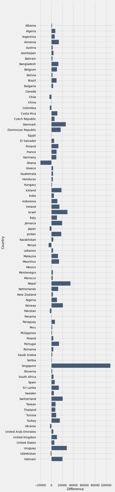
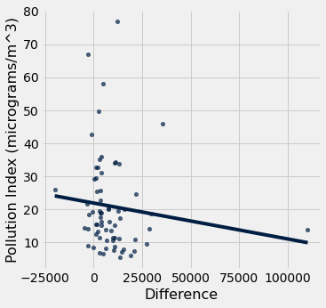
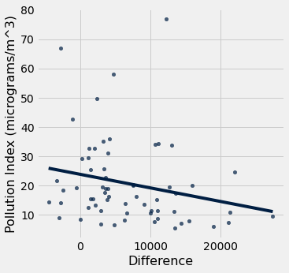

# Toyota Corolla
## But why?
Initially, I was searching for a product that I knew for sure had very different prices around the world so that it would be more interesting to do the data analysis, as there would be a multitude of reasons for the price differences. I was well aware that car prices are different around the world. Like in my country Pakistan, we have 200 percent import duties on cars, making it very expensive to buy a car, compared to a place like Dubai where there are barely any taxes when you buy a car.

*Note: We also kept in mind that a good product to use for our index should be something akin to being a necessity.*  

## Steps we took to create our index:

As a general overview of our process, using Jupyter Notebooks, we organized and analyzed our data using techniques learnt in CMPUT 191. We also used a combination of web scraping, requesting from an API and some good ol' fashioned data cleaning. 

### Scraping!
- After finding our source containing relevant pricing information on our Toyota Corolla model of choice, we used web scraping to import our data.

### Data Cleaning!
- Cleaning our web scraped data…
    - We went through our imported table, dropped unnecessary columns (ie. ‘Rank’) and relabeled columns we planned on using for the sake of convenience and readability. 

### More Cleaning!
- Cleaning a csv file with data on Country, CountryCode, Currency and CurrencyCode.
    - After dropping “Country Code” from the imported csv as it was irrelevant to our analysis, we joined the two tables we had using ‘Country’ that appears in both tables. 

### Assumptions!
- Next, we imported and cleaned a table with information on tax rates per country. However we decided not to factor in GST to the sale price for two reasons:
    - We found that car prices are impacted by many other taxes, duties and customs depending on the country. 
    - Documentation did not specify whether or not the prices shown in their tables were before or after tax. As a result, we decided to keep the GST data available in our tables if further information was given in the future. 

### Joining! (And Even More Cleaning!)
- Joined and cleaned the GST table with our latest version of our Toyota-Prices table.

### Analytics!
- We found an API that converted currencies to a specified base currency.
    - After defining a function that would request conversions, we used `.apply` to create a column that converted our original prices (USD) to their respective local currencies.
    - We also converted from USD to CAD using the same method. We also made sure not to include any rows where there was missing data for local currencies as the API did not have information for lesser known currencies.
    - After defining the price of a Toyota Corolla in Canada, we then used that price to find the difference in price between each Country and Canada. From this, we were able to obtain a horizontal bar chart to obtain a relatively decent scale of the price differences between the respective country and Canada:

# External Factors
## Which external factor did we choose and why?

We decided to see if levels of pollution had an effect on the price of Toyota Corollas by country as it is known that certain countries will raise the price of its cars in an attempt to reduce pollution. As an example, as of 2022, Singapore has a tax (‘Excise Duty’) that is 20% of any car’s OMV (open market value). 

Our logic was: If the pollution in a given country is higher, the price of a Corolla would be higher as well due to regulations made in an attempt to curb pollution output. We thought that the prices would increase in order to make it harder to purchase a car and contribute to the country’s pollution. 

We decided to do some analysis!

### But wait... something's not right??

 AH! There we go!

 
    

 
Unfortunately, there must have been other factors that could have played a role in this, as the line appears to have a very weak correlation due to it's R value of -0.222650693879
    

# Conclusion
## Interesting finds: 
After graphing our analysis (Pollution vs Price of Corolla) we discovered the opposite of what we had thought -pollution was greater in countries that had cheaper prices for Corollas. This makes sense as a greater number of people will have access to cars in the countries that they’re cheaper in and as a result, there will be more contributors to the country’s pollution.

## Difficulties/Challenges: 
- The API that we used for currency conversion did not have conversion rates for lesser known places. We decided to remove these countries from our analysis. 
- Github Pages has deprecated the "Theme Picker" option due to a security flaw. Thus we needed to find a workaround, looking for methods of hosting Jekyll websites through Github Pages, but we finally settled for a simple template that would allow us to easily import a theme.

## Max/min prices and their respective locations:
CAD$135,822 - Singapore 

CAD$5688.66 - Ghana 
